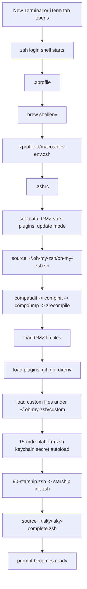

# Terminal Startup Profiling

This runbook profiles slow new-terminal startup on macOS when using `zsh` with Oh My Zsh. It is designed for this repo’s host setup and uses built-in tools or tools that are already present in this environment.

The repo-owned entrypoint is:

```bash
mise run mde:shell:profile
```

Optional benchmark-only entrypoint:

```bash
mise run mde:shell:profile:bench
```

Install or update the managed `zsh-bench` checkout:

```bash
mise run mde:shell:profile:install-bench
```

Outputs are written to:

```text
.artifacts/shell-profile/<timestamp>/
```

Each run now also emits lightweight telemetry and logging artifacts for correlation:

- `run-metadata.json`: subcommand, host shell, cwd, and tool availability
- `commands.log`: exact probes invoked by the workflow
- `xtrace-timeline.md`: condensed event timeline derived from xtrace
- `terminal-session-steps.tsv`: every traced startup step with timestamp and duration-to-next-step
- `terminal-session-workflow.md`: human-readable workflow table plus Mermaid diagram
- `terminal-session-report.md`: combined latency report with workflow diagram
- `zsh-bench-timeline.tsv`: optional `zsh-bench` timeline when the helper is available

## Startup Order

On macOS, new Terminal and iTerm sessions commonly create login, interactive shells. For `zsh`, that means:

1. `.zshenv`
2. `.zprofile`
3. `.zshrc`
4. `.zlogin`

This matters because many “startup is slow” complaints come from work split across both `.zprofile` and `.zshrc`.

- Use `.zprofile` for login-shell environment bootstrapping such as Homebrew and PATH setup.
- Use `.zshrc` for interactive shell features such as Oh My Zsh, prompt init, completion, plugins, aliases, and secret autoload.

Official reference: [zsh startup files](https://zsh.sourceforge.io/Doc/Release/Files.html).

## Workflow

### Layer 1: Coarse baseline

Use a simple timing run first:

```bash
mise run mde:shell:profile:baseline
```

This uses `hyperfine` when present, otherwise `/usr/bin/time -lp`, against:

```bash
zsh -il -c exit
```

Treat this as a regression metric only. It is useful for “did my change make startup better or worse?” but it is not the best measure of what you feel when opening a new terminal.

Why: `time zsh -i -c exit` tells you how long that command takes, not when the first prompt appears or when the shell becomes usable. For user-visible interactive latency, `zsh-bench` is better.

### Layer 2: Shell-function attribution with `zprof`

Use `zprof` to see which shell functions dominate startup:

```bash
mise run mde:shell:profile:zprof
```

This creates a temporary `ZDOTDIR`, loads `zmodload zsh/zprof`, then sources your real shell startup files without modifying them.

Interpretation:

- `compinit`, `compdump`, `compdef`: completion initialization and cache rebuilds.
- `_omz_source`: Oh My Zsh framework/plugin/theme loading cost.
- `mde_export_secret`: repo-managed keychain reads during startup.
- `add-zsh-hook`, `colors`, prompt helpers: usually minor unless repeated heavily.

Official reference: [zsh/zprof module](https://zsh.sourceforge.io/Doc/Release/Zsh-Modules.html#The-zsh_002fzprof-Module).

### Layer 2.5: User-visible latency with `zsh-bench`

Use the optional benchmark path when you want prompt latency instead of only shell-internal attribution:

```bash
mise run mde:shell:profile:bench
```

This runs `zsh-bench` when it is present in the managed checkout, on `PATH`, or when `MDE_ZSH_BENCH_BIN` points at a checkout or installed binary.

Expected artifacts:

- `zsh-bench.txt`
- `zsh-bench-timeline.tsv`

This remains opt-in. The default repo workflow still works without unmanaged installs.

The managed install path used by this repo is:

```text
~/.local/share/mde/tools/zsh-bench
```

### Layer 3: Timestamped xtrace

Use xtrace when you need order plus wall-time gaps:

```bash
mise run mde:shell:profile:xtrace
```

This captures:

- `xtrace.log`: raw timestamped shell trace
- `xtrace-top-gaps.txt`: the biggest gaps between traced lines
- `xtrace-timeline.md`: condensed event table for sourced files and notable commands
- `terminal-session-steps.tsv`: the full traced step stream with per-step durations
- `terminal-session-workflow.md`: table + Mermaid workflow diagram of the session path

This is the best repo-owned method for finding external commands that `zprof` cannot attribute well, such as:

- `starship init zsh`
- `security find-generic-password`
- `brew shellenv`
- `. ~/.sky/.sky-complete.zsh`
### Optional: Syscall and file tracing

Use only when the other layers are insufficient:

```bash
mise run mde:shell:profile:syscalls -- --allow-sudo
```

This is best-effort and may need cached `sudo` credentials. Focus on:

- child process launches
- file stats and reads under `~/.oh-my-zsh`
- `.zcompdump` access
- keychain and `security` access

## Common Offenders

### `compinit`, `compdump`, `compdef`

This is usually the first place to look. Symptoms:

- `compinit` dominates `zprof`
- `compdump` appears high in one run but not another
- xtrace shows large gaps while `.zcompdump` is built or refreshed

Typical causes:

- very large `fpath`
- duplicate completion directories
- stale or frequently rebuilt completion dump
- too many plugins registering completions

### Prompt and theme init

Prompt frameworks often execute external binaries or set hooks.

- Starship shows up in xtrace as a gap around `starship init zsh`.
- Some OMZ themes increase per-command cost more than startup cost.
- Async prompt features can improve perceived startup, but still need tracing if they spawn work.

### Plugin count and plugin behavior

Oh My Zsh itself is not automatically the problem. The main issue is what gets loaded through it.

- Keep `plugins=(...)` minimal.
- Prefer tracing specific plugins over blaming the framework.
- Watch for plugins that shell out to cloud CLIs, version managers, or large completion scripts.

### Keychain reads via `security`

Any startup path that calls `security find-generic-password` can add noticeable cost.

In this repo, that is currently tied to `mde_export_secret` in `~/.oh-my-zsh/custom/15-mde-platform.zsh`.

### Login-shell bootstrappers

These often live in `.zprofile` and are invisible if you only inspect `.zshrc`.

Examples:

- `eval "$(/opt/homebrew/bin/brew shellenv)"`
- version-manager activation in login context

### Update checks

Frameworks and CLIs that phone home or check for updates can add noise.

- Oh My Zsh update behavior is controlled with `zstyle ':omz:update' ...`.
- Frequency `0` is explicitly not recommended.

## What To Do Next In This Environment

Current local findings point to these specific suspects:

1. `compinit` / `compdump` / `compdef`
   - This is the dominant startup bucket in local `zprof`.
   - Start by checking duplicate completion sources and whether `.zcompdump` is being rebuilt too often.

2. Starship
   - `~/.oh-my-zsh/custom/90-starship.zsh` runs `eval "$(starship init zsh)"`.
   - Use xtrace to quantify its startup gap before changing prompt behavior.

3. Oh My Zsh update mode
   - The current `.zshrc` uses `zstyle ':omz:update' mode auto`.
   - If startup jitter is intermittent, confirm whether update checks correlate with it.

4. SkyPilot completion
   - `. ~/.sky/.sky-complete.zsh` is sourced directly in `.zshrc`.
   - This should be traced as a potential external completion cost.

5. Homebrew
   - `.zprofile` currently runs `brew shellenv`.
   - This is a login-shell cost, so include `.zprofile` in any startup investigation.

6. Secret autoload
   - `~/.oh-my-zsh/custom/15-mde-platform.zsh` loads secrets from Keychain unless disabled.
   - If startup is slow on every new tab, confirm whether keychain reads are still happening despite env file autoload.

## Traced Session Workflow

The repo profiler already captures `zprof` and `.zshrc`-scoped xtrace. For a full new-terminal session on this machine, a one-off login-shell trace was also run so the login path through `.zprofile` is included.

Artifacts from that run:

- `.artifacts/shell-profile/20260316-125238/baseline.txt`
- `.artifacts/shell-profile/20260316-125238/zprof.txt`
- `.artifacts/shell-profile/20260316-125238/xtrace.log`
- `.artifacts/shell-profile/20260316-125238/xtrace-top-gaps.txt`
- `.artifacts/shell-profile/full-session-20260316-125333.log`

### High-level startup flow



### Traced file and script order

```mermaid
flowchart TD
    A["1773683613.909959<br/>source ~/.zprofile"] --> B["1773683613.910653<br/>run /opt/homebrew/bin/brew shellenv"]
    B --> C["1773683613.931857<br/>eval brew shellenv output"]
    C --> D["1773683613.936575<br/>source ~/.zprofile.d/macos-dev-env.zsh"]
    D --> F["1773683613.945320<br/>source ~/.zshrc"]
    F --> G["set fpath, ZSH, theme, OMZ update mode, plugins"]
    G --> H["source ~/.oh-my-zsh/oh-my-zsh.sh"]
    H --> I["1773683568.541178 -> 1773683569.315873<br/>completion bootstrap"]
    I --> J["load OMZ libs"]
    J --> K["load OMZ plugins"]
    K --> L["1773683569.376480<br/>10-mde-core.zsh"]
    L --> M["1773683569.379743<br/>15-mde-platform.zsh"]
    M --> N["1773683614.797894<br/>security find-generic-password"]
    N --> O["1773683569.408296<br/>20-mde-aliases.zsh"]
    O --> P["1773683569.411135<br/>90-starship.zsh"]
    P --> Q["1773683614.819404<br/>starship init zsh"]
    Q --> R["1773683614.864523<br/>eval generated Starship hooks"]
    R --> S["1773683569.463190+<br/>remaining custom files"]
    S --> T["1773683614.874403<br/>source ~/.sky/.sky-complete.zsh"]
    T --> U["1773683614.875050<br/>shell ready / trace exits"]
```



### Traced OMZ custom file order


### Measured hotspots from the traced session

- `compinit` / `compdump` / `compdef` remain the dominant startup bucket.
- `brew shellenv` took about `21 ms` in `.zprofile`.
- `security find-generic-password` took about `21 ms` for the traced `LANGSMITH_WORKSPACE_ID` keychain read.
- `starship init zsh` took about `42-45 ms`.
- `~/.sky/.sky-complete.zsh` is sourced after OMZ and Starship, so it should be evaluated as a separate post-OMZ completion cost rather than folded into OMZ itself.

## Optional Upstream Tool: `zsh-bench`

If you want user-visible latency instead of only shell-internal attribution, use [`zsh-bench`](https://github.com/romkatv/zsh-bench).

Why it is better:

- it measures first prompt lag
- it measures first command lag
- it measures input lag and command lag
- it explicitly explains why `time zsh -il -c exit` is insufficient

This repo keeps `zsh-bench` as an optional managed checkout rather than a hard dependency. Install it with `mise run mde:shell:profile:install-bench` and the profiler will auto-detect `~/.local/share/mde/tools/zsh-bench/zsh-bench`. Override with `MDE_ZSH_BENCH_BIN` if you need a different checkout or binary.
